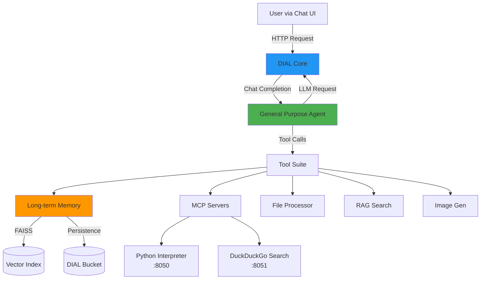

# AI DIAL General Purpose Agent Documentation

## Overview

The **AI DIAL General Purpose Agent** is a demonstration project showcasing an intelligent conversational agent with **persistent, user-specific long-term memory**. Built on the [AI DIAL platform](https://epam-rail.com/), this agent can remember user preferences, facts, and context across conversations while providing capabilities like web search, Python code execution, image generation, and document processing.

**Key Features:**
- 🧠 **Long-term Memory**: Semantic storage and retrieval of user information using FAISS vector search
- 🔍 **Web Search**: DuckDuckGo integration via MCP server
- 🐍 **Code Execution**: Stateful Python interpreter with Jupyter kernel
- 🎨 **Image Generation**: DALL-E via DIAL Core
- 📄 **File Processing**: PDF, CSV, TXT content extraction
- 📚 **RAG Search**: Semantic search across uploaded documents

## Documentation Structure

| Document | Description |
|----------|-------------|
| **[Setup Guide](./setup.md)** | Environment configuration, installation, and deployment |
| **[Architecture](./architecture.md)** | System design, data flows, and component interactions |
| **[API Reference](./api.md)** | Tool schemas, agent interfaces, and integration patterns |
| **[Testing Guide](./testing.md)** | Test strategy, coverage, and validation workflows |
| **[Glossary](./glossary.md)** | Domain terms, abbreviations, and technical concepts |
| **[ADRs](./adr/)** | Architecture decision records with rationales |
| **[Roadmap](./roadmap.md)** | Future enhancements and known limitations |

## Quick Start

### Prerequisites
- Python 3.12+
- Docker & Docker Compose
- macOS, Linux, or Windows with WSL2

### Launch in 3 Steps

```bash
# 1. Activate virtual environment
source dial_agent_with_memory/bin/activate

# 2. Start DIAL infrastructure (Chat UI, Core, Redis, MCP servers)
docker-compose up -d

# 3. Run agent application
python -m task.app
```

Access the Chat UI at [http://localhost:3000](http://localhost:3000)

**⚠️ Security Warning**: Remove API keys from `core/config.json` before committing to version control.

## Architecture at a Glance



## Key Concepts

### Long-Term Memory System

The agent stores user-specific memories (name, location, preferences, goals) in a DIAL bucket using:
- **FAISS** for semantic vector search (all-MiniLM-L6-v2 embeddings)
- **JSON storage** in user-isolated bucket paths
- **Automatic deduplication** for similar memories (>75% similarity)
- **In-memory caching** for fast repeated access

**Workflow:**
1. User shares information → Agent stores memory with embedding
2. User asks contextual question → Agent searches memories → Uses context for response
3. User requests deletion → Agent wipes all stored memories

See [Architecture - Memory System](./architecture.md#long-term-memory-system) for details.

### MCP (Model Context Protocol) Integration

External capabilities are provided by MCP servers:
- **Python Code Interpreter** (port 8050): Stateful Jupyter kernel for code execution
- **DuckDuckGo Search** (port 8051): Web search and content fetching

The agent automatically discovers and wraps MCP tools at startup. See [Architecture - MCP Integration](./architecture.md#mcp-integration).

## Project Structure

```
ai-dial-general-purpose-agent-with-memory/
├── task/                       # Agent implementation
│   ├── app.py                  # DIAL app + tool registration
│   ├── agent.py                # Orchestration loop
│   ├── prompts.py              # System prompt configuration
│   ├── tools/                  # Tool implementations
│   │   ├── memory/             # Long-term memory (store/search/delete)
│   │   ├── mcp/                # MCP client + tool wrapper
│   │   ├── rag/                # Document search
│   │   ├── files/              # File content extraction
│   │   ├── deployment/         # Image generation
│   │   └── py_interpreter/     # Python code execution adapter
│   └── utils/                  # Helpers (history, stages, constants)
├── core/                       # DIAL Core configuration
│   └── config.json             # Models, deployments, API keys
├── docker-compose.yml          # Full stack services
├── requirements.txt            # Python dependencies
└── docs/                       # This documentation
```

## Common Workflows

### Storing Memories
User shares facts → Agent automatically calls `store_memory` tool without asking permission → Memory saved with embedding

### Retrieving Memories
User asks personal question → Agent searches memories first → Uses context for personalized response

### Using Web Search
User asks about current events → Agent searches DuckDuckGo → Summarizes results

### Executing Code
User requests calculation/analysis → Agent writes Python code → Executes in MCP server → Returns output

## Development Principles

1. **User Isolation**: All memories are scoped to user buckets via DIAL API keys
2. **Proactive Storage**: Agent stores memories without explicit permission (configurable via system prompt)
3. **Cache Consistency**: All memory tools share a single `LongTermMemoryStore` instance
4. **Stage-based UI**: Tools report progress via stages for transparent feedback
5. **Stateless Agent**: Tool call history persisted in `choice.state` across requests

## Contributing

This is a training/demonstration project. For production use:
- Add comprehensive test coverage (see [testing.md](./testing.md))
- Implement rate limiting and quota management
- Add monitoring and observability (logging, tracing)
- Secure API key management (environment variables, secret stores)
- Performance optimization for large memory collections

## Resources

- **AI DIAL Platform**: [https://epam-rail.com/](https://epam-rail.com/)
- **DIAL SDK Docs**: [aidial-sdk documentation](https://github.com/epam/ai-dial-sdk)
- **MCP Specification**: [Model Context Protocol](https://modelcontextprotocol.io/)
- **FAISS**: [Facebook AI Similarity Search](https://github.com/facebookresearch/faiss)

## License

TODO: Add license information

## Support

For issues or questions:
- Review [Architecture](./architecture.md) for design decisions
- Check [Setup Guide](./setup.md) for configuration help
- See [ADRs](./adr/) for historical context

---

**Next Steps:**
1. Read [Setup Guide](./setup.md) for detailed installation
2. Explore [Architecture](./architecture.md) to understand system design
3. Review [API Reference](./api.md) for tool schemas and interfaces
