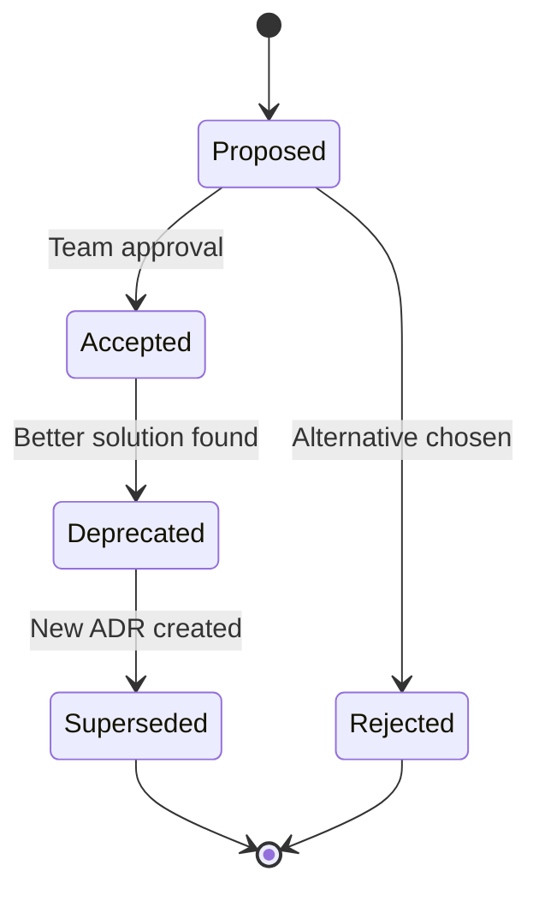

# Architecture Decision Records (ADR)

This directory contains Architecture Decision Records documenting key design choices for the AI DIAL General Purpose Agent with Long-Term Memory.

## What is an ADR?

An Architecture Decision Record (ADR) captures an important architectural decision made along with its context and consequences.

**Format:**
- **Status:** Accepted / Rejected / Superseded
- **Context:** Problem statement and requirements
- **Decision:** Chosen solution
- **Rationale:** Why this solution was selected
- **Consequences:** Positive, negative, and neutral outcomes
- **Alternatives:** Options considered and rejected

## Index of ADRs

| ADR | Title | Status | Date |
|-----|-------|--------|------|
| [001](./ADR-001-memory-storage.md) | Memory Storage Format | Accepted | 2025-12-31 |
| [002](./ADR-002-embedding-model.md) | Embedding Model Selection | Accepted | 2025-12-31 |
| [003](./ADR-003-mcp-integration.md) | MCP vs Native Tools | Accepted | 2025-12-31 |
| [004](./ADR-004-deduplication.md) | Deduplication Strategy | Accepted | 2025-12-31 |

## Quick Reference

### ADR-001: Memory Storage Format
**Decision:** Single JSON file per user in DIAL bucket  
**Key Rationale:** Simplicity, zero infrastructure overhead, automatic user isolation  
**Trade-offs:** Limited to ~10k memories before performance degrades

### ADR-002: Embedding Model Selection
**Decision:** all-MiniLM-L6-v2 (384 dimensions)  
**Key Rationale:** Best balance of speed, accuracy, and size for short-text similarity  
**Trade-offs:** Lower accuracy than larger models, not multilingual

### ADR-003: MCP vs Native Tools
**Decision:** Hybrid approach (memory native, code/search via MCP)  
**Key Rationale:** Security for code execution, reusability of search, direct bucket access for memory  
**Trade-offs:** Mixed patterns increase conceptual complexity

### ADR-004: Deduplication Strategy
**Decision:** Periodic dedup with 75% cosine similarity threshold  
**Key Rationale:** Prevents storage bloat, improves search quality, runs automatically  
**Trade-offs:** 5-30s processing time, irreversible merges

## Creating New ADRs

When making significant architectural decisions:

1. **Copy Template:**
   ```bash
   cp ADR-000-template.md ADR-005-your-decision.md
   ```

2. **Fill Sections:**
   - Context: Why are we making this decision?
   - Options: What alternatives exist?
   - Decision: What did we choose?
   - Rationale: Why this option?
   - Consequences: What are the impacts?

3. **Update Index:**
   Add entry to this README.md

4. **Link from Code:**
   ```python
   # Memory store implementation follows ADR-001 (single JSON file)
   # See: docs/adr/ADR-001-memory-storage.md
   ```

## ADR Lifecycle



**Status Meanings:**
- **Proposed:** Under discussion
- **Accepted:** Active decision guiding implementation
- **Deprecated:** Still in code but not recommended for new features
- **Rejected:** Alternative chosen, explains why
- **Superseded:** Replaced by newer ADR (link to replacement)

## Related Documentation

- [Architecture Overview](../architecture.md) - System design
- [API Reference](../api.md) - Implementation details
- [Roadmap](../roadmap.md) - Future architectural changes

## Guidelines

### When to Write an ADR

Write an ADR for decisions that:
- ✅ Affect system architecture (storage, protocols, patterns)
- ✅ Have multiple viable alternatives
- ✅ Have significant trade-offs
- ✅ Will impact future development
- ✅ Are hard to reverse

**Don't write ADRs for:**
- ❌ Implementation details (variable names, folder structure)
- ❌ Obvious choices (use JSON for config, not XML)
- ❌ Temporary workarounds
- ❌ External library choices (unless multiple options)

### ADR Best Practices

1. **Be Specific:** "Use Redis for caching" not "Add a cache"
2. **Include Context:** Explain the problem, not just the solution
3. **List Alternatives:** Show you considered other options
4. **Quantify Trade-offs:** "10x faster but 2x memory usage"
5. **Link Evidence:** Benchmark results, research papers, similar projects

### Example Decision Points

**Good ADR Topics:**
- Storage architecture (SQL vs. NoSQL vs. file-based)
- Embedding model selection (accuracy vs. speed vs. cost)
- Integration pattern (REST vs. gRPC vs. MCP)
- Deduplication algorithm (threshold, timing, merge policy)
- Caching strategy (in-memory vs. Redis vs. none)

**Not ADR-Worthy:**
- Choosing between two equivalent libraries
- Code formatting preferences
- Test file organization
- Minor parameter tuning

---

## Change Log

| Date | Change | Author |
|------|--------|--------|
| 2025-12-31 | Created initial ADRs (001-004) | Training Project |

---

**Questions?** See [Contributing Guide](../README.md#contributing) or open an issue.
