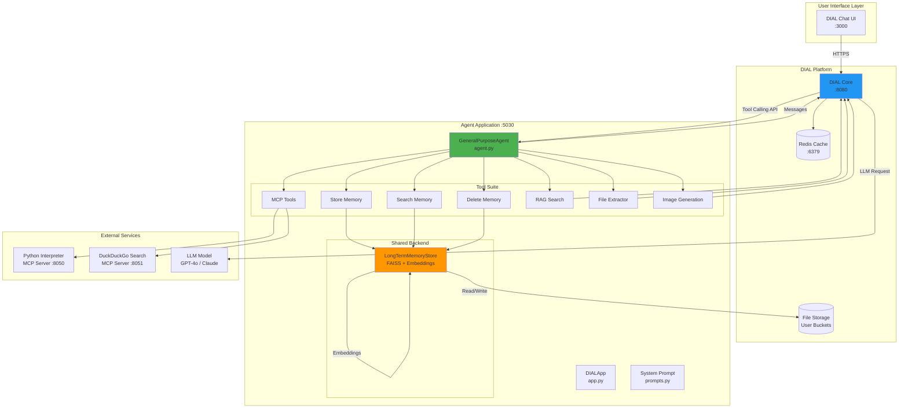
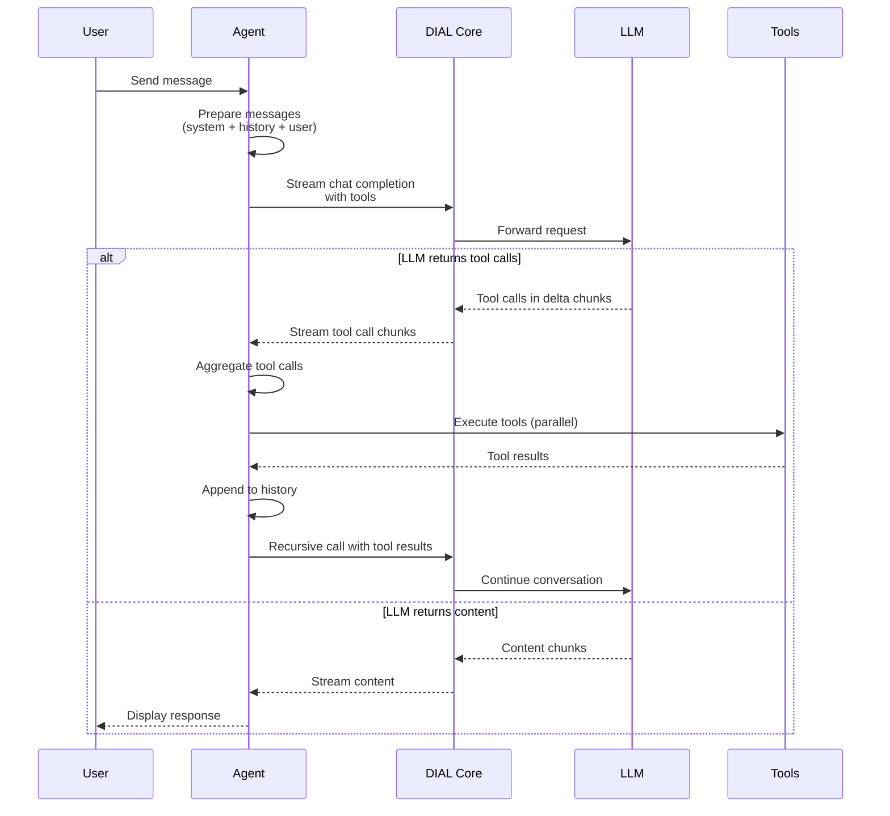
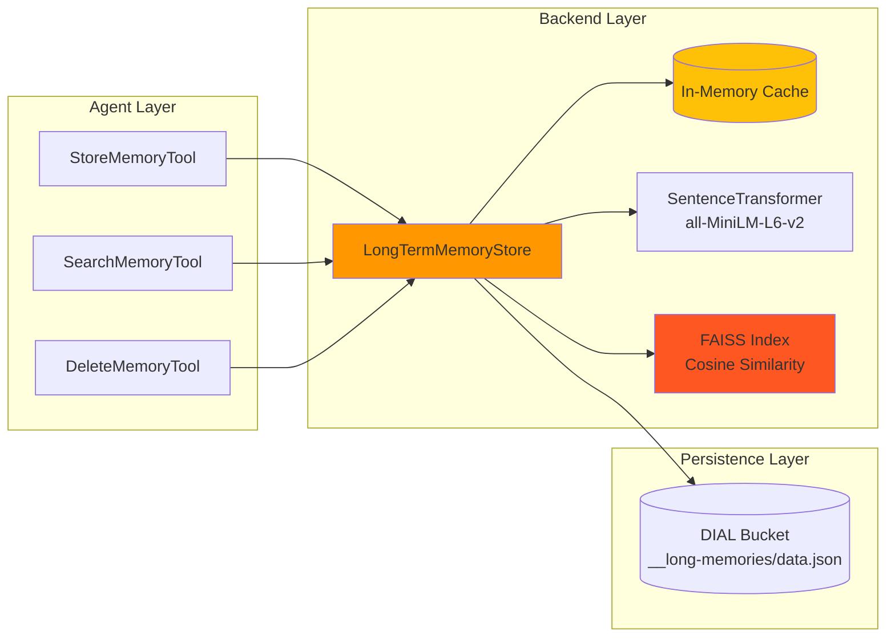
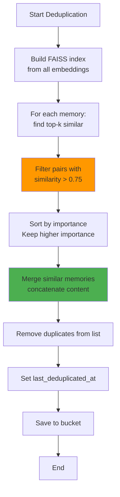
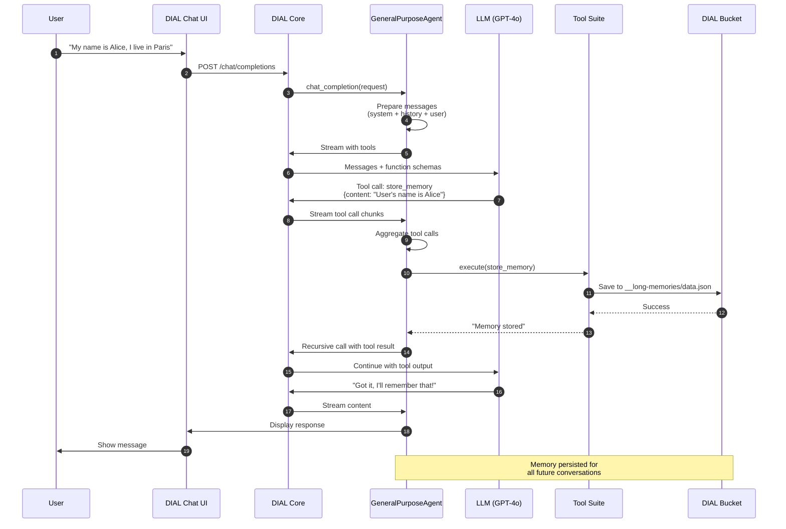
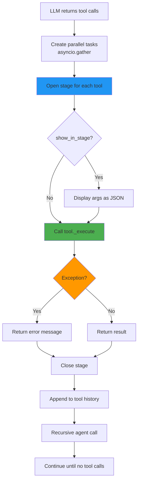
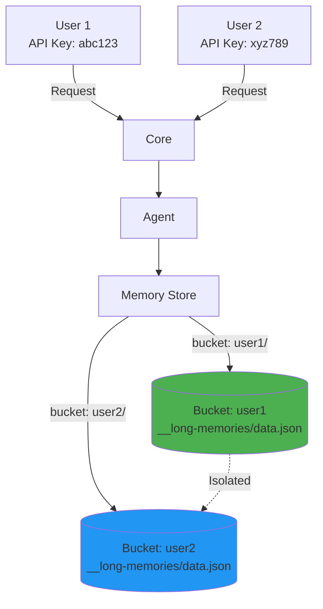

# Architecture

## Table of Contents
- [System Overview](#system-overview)
- [Core Components](#core-components)
- [Long-Term Memory System](#long-term-memory-system)
- [MCP Integration](#mcp-integration)
- [Request Flow](#request-flow)
- [Tool Architecture](#tool-architecture)
- [State Management](#state-management)
- [Security Model](#security-model)
- [Performance Considerations](#performance-considerations)

## System Overview

The AI DIAL General Purpose Agent is built as a **tool-calling orchestrator** that delegates specialized tasks to a suite of integrated capabilities. The architecture follows a hub-and-spoke pattern where the central agent coordinates between the LLM (via DIAL Core) and various tool implementations.



### Design Principles

1. **Single Responsibility**: Each tool handles one capability (memory storage, web search, etc.)
2. **User Isolation**: All operations scoped to user-specific API keys and buckets
3. **Stateless Agent**: Conversation state persisted via DIAL SDK, not in-memory
4. **Shared Resources**: Memory backend shared across tools for cache consistency
5. **Progressive Disclosure**: Stage-based UI shows tool execution in real-time

## Core Components

### 1. DIAL App (`task/app.py`)

Entry point that:
- Registers the agent as a DIAL chat completion endpoint
- Initializes tools at startup (lazy loading on first request)
- Creates shared `LongTermMemoryStore` instance
- Configures MCP client connections

**Key Code:**
```python
class GeneralPurposeAgentApplication(ChatCompletion):
    def __init__(self):
        self.tools: list[BaseTool] = []
        self.memory_store = LongTermMemoryStore(endpoint=DIAL_ENDPOINT)
    
    async def _create_tools(self) -> list[BaseTool]:
        # Initialize all tools, sharing memory_store instance
        tools = [
            StoreMemoryTool(memory_store=self.memory_store),
            SearchMemoryTool(memory_store=self.memory_store),
            DeleteMemoryTool(memory_store=self.memory_store),
            # ... other tools
        ]
        return tools
```

### 2. General Purpose Agent (`task/agent.py`)

Orchestration loop that:
- Prepares messages (system prompt + unpacked history + user message)
- Streams LLM responses with function calling
- Executes tool calls in parallel (via `asyncio.gather`)
- Recursively handles multi-turn tool conversations
- Manages stage lifecycle for UI feedback

**Request Flow:**


### 3. System Prompt (`task/prompts.py`)

**Critical component** that guides LLM behavior:
- **Proactive memory storage**: Store facts without asking permission
- **Automatic memory search**: Check memories before answering personal questions
- **Explicit deletion**: Only delete on clear user intent
- **Tool usage guidelines**: When to use web search, code execution, etc.

**Challenge**: Getting the LLM to consistently use memory tools requires precise prompt engineering. Expected to iterate multiple times during implementation.

## Long-Term Memory System

### Architecture



### Data Flow

**Storage:**
1. User shares fact → Tool parses arguments (content, importance, category, topics)
2. `LongTermMemoryStore.add_memory()` generates embedding using sentence-transformers
3. Memory appended to collection (list of Memory objects)
4. Check if deduplication needed (>10 memories, >24h since last run)
5. Save to `{user_bucket}/__long-memories/data.json`
6. Update in-memory cache

**Search:**
1. User asks contextual question → Tool calls `LongTermMemoryStore.search_memories()`
2. Query text converted to embedding vector
3. FAISS performs cosine similarity search (k=5 by default)
4. Return top-k memories with similarity scores
5. Agent uses context to inform response

**Deletion:**
1. User says "forget me" → Tool calls `LongTermMemoryStore.delete_all_memories()`
2. Delete `data.json` from bucket
3. Clear in-memory cache
4. Return confirmation

### Storage Format

```json
{
  "memories": [
    {
      "data": {
        "id": 1735689600,
        "content": "User lives in Paris, France",
        "importance": 0.9,
        "category": "personal_info",
        "topics": ["location", "geography"]
      },
      "embedding": [0.023, -0.145, ..., 0.089]
    }
  ],
  "updated_at": "2025-12-31T12:00:00Z",
  "last_deduplicated_at": null
}
```

**Key Properties:**
- **Single file per user**: Simplifies locking and consistency
- **Embeddings stored**: Avoids recomputation on every search
- **384 dimensions**: all-MiniLM-L6-v2 model (lightweight, fast)
- **~6-8KB per memory**: 1000 memories ≈ 6-8MB file

### Deduplication Algorithm

Runs when conditions met: `len(memories) > 10 AND time_since_last_dedup > 24h`



**Complexity**: O(n log n) due to FAISS batch search, efficient for up to ~100k memories.

### Cache Strategy

```python
self._cache: dict[str, MemoryCollection] = {}
```

**Key**: File path (`files/{bucket}/__long-memories/data.json`)
**Value**: Full `MemoryCollection` object (memories + metadata)

**Rationale:**
- User bucket paths are unique per user → ensures isolation
- Cache persists within agent session → reduces DIAL API calls
- All tools share same instance → consistent view of memories
- Cache invalidated on save → prevents stale reads

**Trade-off**: Memory usage grows with active users, but typical collections (<1000 memories) are ~6-8MB each.

## MCP Integration

### Architecture

```mermaid
graph TB
    subgraph "Agent Process"
        App[app.py]
        MCPClient[MCPClient]
        MCPTool1[MCPTool: execute_code]
        MCPTool2[MCPTool: ddg_search]
    end
    
    subgraph "Python Interpreter :8050"
        Server1[MCP Server<br/>Streamable HTTP]
        Jupyter[Jupyter Kernel<br/>Stateful Execution]
    end
    
    subgraph "DuckDuckGo Search :8051"
        Server2[MCP Server<br/>Streamable HTTP]
        DDGLib[DuckDuckGo API]
    end
    
    App -->|create()| MCPClient
    MCPClient -->|get_tools()| Server1
    MCPClient -->|get_tools()| Server2
    
    App --> MCPTool1
    App --> MCPTool2
    
    MCPTool1 -->|call_tool()| MCPClient
    MCPTool2 -->|call_tool()| MCPClient
    
    MCPClient -->|HTTP/SSE| Server1
    MCPClient -->|HTTP/SSE| Server2
    
    Server1 --> Jupyter
    Server2 --> DDGLib
    
    style MCPClient fill:#9C27B0
    style Server1 fill:#3F51B5
    style Server2 fill:#3F51B5
```

### Connection Pattern

1. **Factory Creation**: `MCPClient.create(url)` establishes HTTP connection and verifies server availability
2. **Tool Discovery**: `await mcp_client.get_tools()` fetches available MCP tools as JSON schemas
3. **Wrapper Instantiation**: Each MCP tool wrapped in `MCPTool` adapter implementing `BaseTool` interface
4. **Execution**: `MCPTool._execute()` delegates to `mcp_client.call_tool(name, args)`

**Example: Python Interpreter**
```python
await PythonCodeInterpreterTool.create(
    mcp_url="http://localhost:8050/mcp",
    tool_name="execute_code",
    dial_endpoint=DIAL_ENDPOINT
)
```

Creates a tool that:
- Accepts Python code as string
- Sends to MCP server via HTTP
- Returns stdout/stderr + execution status
- Maintains stateful kernel (variables persist across calls)

### Protocol Details

**Transport**: Streamable HTTP with Server-Sent Events (SSE)
**Request Format**: JSON-RPC 2.0
**Tool Schema**: JSON Schema compatible with OpenAI function calling

**Advantages:**
- Language agnostic (any server implementing MCP spec)
- Easy to add new capabilities without agent code changes
- Isolated execution environments for security

## Request Flow

### End-to-End Sequence



### History Management

DIAL's compact message format requires unpacking before sending to LLM:

```python
def unpack_messages(messages: list[Message], tool_history: list[dict]) -> list[dict]:
    # Expands DIAL messages + tool_history into full OpenAI-compatible format
    # Inserts assistant messages with tool_calls
    # Inserts tool messages with results
    # Returns: [{role, content, tool_calls?}, ...]
```

**State Serialization:**
```python
self.state[TOOL_CALL_HISTORY_KEY] = [...]
choice.set_state(self.state)  # Persists across requests
```

Agent is **stateless** - all conversation context stored in:
1. DIAL Core's message history
2. `choice.state` dictionary (tool call history)
3. DIAL bucket (long-term memories)

## Tool Architecture

### Base Tool Pattern

All tools inherit from `BaseTool` abstract class:

```mermaid
classDiagram
    class BaseTool {
        <<abstract>>
        +execute(params: ToolCallParams) Message
        #_execute(params: ToolCallParams) str | Message*
        +create_tool_stage: bool
        +show_in_stage: bool
        +name: str*
        +description: str*
        +parameters: dict*
        +schema: dict
    }
    
    class StoreMemoryTool {
        -memory_store: LongTermMemoryStore
        +name: "store_memory"
        +description: "Store important user facts..."
        +parameters: {content, importance, category, topics}
        #_execute() str
    }
    
    class SearchMemoryTool {
        -memory_store: LongTermMemoryStore
        +name: "search_memories"
        +description: "Search stored memories..."
        +parameters: {query, limit}
        #_execute() str
    }
    
    class MCPTool {
        -client: MCPClient
        -mcp_tool_model: MCPToolModel
        +name: from MCP schema
        +description: from MCP schema
        +parameters: from MCP schema
        #_execute() str
    }
    
    BaseTool <|-- StoreMemoryTool
    BaseTool <|-- SearchMemoryTool
    BaseTool <|-- MCPTool
    BaseTool <|-- RagTool
    BaseTool <|-- FileContentExtractionTool
```

### Tool Execution Flow



### Stage Processor

Stages provide progressive UI feedback:

```python
stage = StageProcessor.open_stage(choice, tool_name)
stage.append_content("## Request arguments:\n```json\n...\n```")
stage.append_content("## Response:\n...")
StageProcessor.close_stage_safely(stage)
```

**Lifecycle:**
1. Open stage when tool execution starts
2. Append request arguments (if `show_in_stage=True`)
3. Tool appends intermediate results (optional)
4. Close stage when execution completes
5. Stage appears as collapsible section in Chat UI

## State Management

### Agent State

```python
self.state = {
    TOOL_CALL_HISTORY_KEY: [
        {role: "assistant", tool_calls: [...]},
        {role: "tool", name: "store_memory", content: "..."},
        ...
    ]
}
```

**Serialization**: `choice.set_state(self.state)` at end of `handle_request()`
**Deserialization**: Automatic via DIAL SDK on next request
**Purpose**: Enables stateless agent restarts without losing conversation context

### Memory Cache

```python
# In LongTermMemoryStore
self._cache: dict[str, MemoryCollection] = {}
```

**Scope**: Agent process lifetime (survives across requests, not across restarts)
**Invalidation**: On memory save/delete operations
**Isolation**: Keyed by file path → user-specific

### Document Cache

RAG tool maintains cache of processed documents:
- Parses uploaded files into chunks
- Stores embeddings + chunk text
- Expires when conversation ends (not persisted to bucket)

## Security Model

### User Isolation



**Enforcement:**
- DIAL Core maps API keys to user buckets
- Agent passes `api_key` to all DIAL API calls
- Memory store uses `get_app_home_path()` to resolve user-specific bucket
- No shared state between users (cache keys include bucket path)

### API Key Management

**Current Implementation (Development Only):**
```json
// core/config.json
{
  "keys": {
    "dial_api_key": "secret",
    "openai-key": "sk-...",
    "anthropic-key": "sk-..."
  }
}
```

**⚠️ Critical Security Requirement:**
Delete API keys from `core/config.json` before committing to version control.

**Production Recommendations:**
- Store keys in environment variables
- Use secret management services (AWS Secrets Manager, Azure Key Vault)
- Rotate keys regularly
- Implement rate limiting per API key

### Data Privacy

- **Memories**: Stored in user buckets, not accessible to other users
- **Conversations**: DIAL Core handles isolation via bucket paths
- **MCP Servers**: Run in isolated Docker containers
- **No telemetry**: No data sent to external services (except LLM API calls)

## Performance Considerations

### Bottlenecks

1. **Embedding Generation**: `SentenceTransformer.encode()` takes ~50-100ms per memory
   - **Mitigation**: Batch encode if storing multiple memories
   - **Future**: Use pre-computed embeddings or async encoding

2. **FAISS Search**: O(n) for brute-force cosine similarity, O(log n) with IVF index
   - **Current**: Brute force suitable for <10k memories
   - **Future**: Add IVF index if collections exceed 10k memories

3. **DIAL Bucket I/O**: File upload/download adds ~50-200ms latency
   - **Mitigation**: In-memory caching reduces calls to 1 per session
   - **Future**: Use Redis for cross-session caching

4. **Tool Call Latency**: Each tool call adds LLM round-trip (~1-3s)
   - **Mitigation**: Parallel execution via `asyncio.gather`
   - **Trade-off**: More tool calls = slower response, but higher accuracy

### Scalability

**Current Limits:**
- ~10k memories per user before FAISS search slows down
- In-memory cache grows with active users (~6-8MB per user)
- No rate limiting on tool calls

**Scaling Strategies:**
1. **Horizontal**: Run multiple agent instances behind load balancer
2. **Caching**: Add Redis for shared memory cache across instances
3. **Indexing**: Use FAISS IVF for large collections
4. **Pruning**: Implement memory TTL (delete old, low-importance memories)

### Optimization Opportunities


1. **Parallel embedding**: Generate embeddings for multiple memories concurrently
2. **Batch FAISS insert**: Add multiple vectors in single operation
3. **Lazy index building**: Build FAISS index on first search, not every save
4. **Redis cache**: Share memory cache across agent instances
5. **Memory pruning**: Auto-delete low-importance memories older than X days

## Design Decisions

See [ADR documents](./adr/) for detailed rationales:

- [ADR-001: Memory Storage Format](./adr/ADR-001-memory-storage.md) - Why single JSON file per user
- [ADR-002: Embedding Model Selection](./adr/ADR-002-embedding-model.md) - Why all-MiniLM-L6-v2
- [ADR-003: MCP vs Native Tools](./adr/ADR-003-mcp-integration.md) - When to use MCP servers
- [ADR-004: Deduplication Strategy](./adr/ADR-004-deduplication.md) - Similarity threshold and timing

---

**Related Documents:**
- [Setup Guide](./setup.md) - Environment configuration
- [API Reference](./api.md) - Tool schemas and interfaces
- [Testing Guide](./testing.md) - Test strategy and validation
