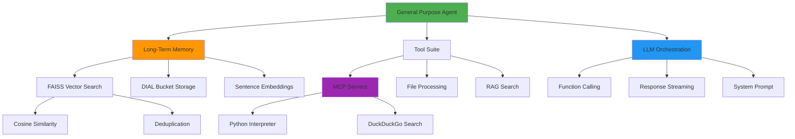

# Glossary

## A

### AI DIAL
**AI DIAL** (AI Development and Integration Layer) - An enterprise platform for building, deploying, and managing AI applications. Provides unified API for multiple LLM providers, user isolation via buckets, and chat UI.

**URL:** [https://epam-rail.com/](https://epam-rail.com/)

### API Key
**API Key** - Authentication token used to identify and authorize users. In DIAL, API keys map to user-specific buckets for data isolation.

**Example:** `dial_api_key`, `sk-proj-...` (OpenAI)

### Async/Await
**Async/Await** - Python concurrency pattern for non-blocking I/O operations. Used throughout the agent for parallel tool execution and DIAL API calls.

```python
async def load_memories():
    result = await dial_client.files.download(path)
    return result
```

## B

### BaseTool
**BaseTool** - Abstract base class for all agent tools. Defines interface: `name`, `description`, `parameters`, `_execute()`.

**Module:** `task.tools.base`

### Bucket
**Bucket** - User-specific storage namespace in DIAL. Each user has isolated bucket for files, memories, and conversation data. Accessed via `files/{bucket}/path`.

**Example Path:** `files/user-abc123/__long-memories/data.json`

## C

### Cache
**Cache** - In-memory storage for frequently accessed data. The agent uses:
- **Memory Cache**: Dict of `{file_path: MemoryCollection}` for fast memory access
- **Document Cache**: Processed document chunks for RAG search

**Trade-off:** Reduces API calls, but increases memory usage

### Category
**Category** - Classification label for memories (e.g., `personal_info`, `preferences`, `goals`). Used for filtering and organization.

**See also:** [Memory System](#memory-system)

### Chat Completion
**Chat Completion** - LLM API endpoint that accepts messages and returns generated responses. Supports streaming and function calling.

**DIAL Endpoint:** `POST /openai/deployments/{name}/chat/completions`

### Choice
**Choice** - DIAL SDK object representing a single response option. Used to stream content and manage stages in the UI.

**Usage:** `choice.append_content("text")`, `choice.set_state(state)`

### Cosine Similarity
**Cosine Similarity** - Metric for measuring similarity between vectors. Used by FAISS to compare memory embeddings.

**Formula:** `cos(θ) = (A · B) / (||A|| × ||B||)`

**Range:** -1 (opposite) to 1 (identical)

## D

### Deduplication
**Deduplication** - Process of merging similar memories to reduce storage and improve search quality. Runs when:
- Memory count > 10
- Time since last dedup > 24 hours
- Similarity threshold > 75%

**Algorithm:** FAISS batch similarity search → merge high-similarity pairs → keep higher importance

### Deployment
**Deployment** - Named LLM configuration in DIAL Core. Maps model name to API endpoint and credentials.

**Example:** `gpt-4o`, `claude-sonnet-3-7`, `dall-e-3`

### DIAL Core
**DIAL Core** - Java backend service that routes requests to LLM providers, manages buckets, and handles authentication.

**Port:** 8080 (default)
**Config:** `core/config.json`

### DIAL SDK
**DIAL SDK** - Python library for building DIAL-compatible applications. Provides `DIALApp`, `ChatCompletion`, `Message`, `Choice` abstractions.

**Package:** `aidial-sdk==0.27.0`

### Docker Compose
**Docker Compose** - Tool for defining multi-container applications. The project uses it to orchestrate DIAL Core, Redis, MCP servers, and Chat UI.

**Config:** `docker-compose.yml`

### DuckDuckGo (DDG)
**DuckDuckGo** - Privacy-focused search engine. Integrated via MCP server for web search capability.

**MCP Port:** 8051

## E

### Embedding
**Embedding** - Dense vector representation of text in high-dimensional space. Captures semantic meaning for similarity search.

**Model:** `all-MiniLM-L6-v2` (384 dimensions)
**Example:** `[0.023, -0.145, 0.089, ...]`

## F

### FAISS
**FAISS** (Facebook AI Similarity Search) - Library for efficient vector similarity search and clustering. Used for memory search via cosine similarity.

**Package:** `faiss-cpu==1.12.0`
**Operations:** Brute-force search, IVF indexing

### Function Calling
**Function Calling** - LLM capability to invoke external tools. Model generates JSON with function name and arguments based on provided schemas.

**Example:**
```json
{
  "id": "call_abc123",
  "type": "function",
  "function": {
    "name": "store_memory",
    "arguments": "{\"content\": \"User lives in Paris\"}"
  }
}
```

## I

### Importance
**Importance** - Float score (0-1) indicating memory priority. Higher importance memories:
- Survive deduplication
- Rank higher in search (tie-breaker)
- Represent core user identity

**Guidelines:**
- 0.8-1.0: Core identity (name, location, job)
- 0.5-0.7: Preferences, habits
- 0.3-0.5: Contextual facts

## J

### JSON Schema
**JSON Schema** - Specification for validating JSON structure. Used to define tool parameters for function calling.

**Example:**
```json
{
  "type": "object",
  "properties": {
    "content": {"type": "string"}
  },
  "required": ["content"]
}
```

### Jupyter Kernel
**Jupyter Kernel** - Execution environment for interactive code. The Python MCP server uses a stateful Jupyter kernel, allowing variables to persist across executions.

**Behavior:** `x = 42` in call 1 → `print(x)` in call 2 works

## L

### LLM (Large Language Model)
**LLM** - Neural network trained on text data to generate human-like responses. Examples: GPT-4o, Claude Sonnet.

**Role in Agent:** Orchestrator that decides when to call tools and how to synthesize responses

### Long-Term Memory
**Long-Term Memory** - Persistent storage of user-specific information across conversations. Implemented using FAISS + DIAL buckets.

**Contrast:** Session memory (conversation history) vs. long-term memory (facts stored indefinitely)

## M

### MCP (Model Context Protocol)
**MCP** - Specification for connecting AI agents to external tools and data sources via HTTP/SSE.

**Servers in Project:**
- Python Interpreter (port 8050)
- DuckDuckGo Search (port 8051)

**Protocol:** JSON-RPC 2.0 over Streamable HTTP

### Memory
**Memory** - Single stored fact about the user with metadata and embedding.

**Structure:**
```python
Memory(
    data=MemoryData(id, content, importance, category, topics),
    embedding=[0.1, 0.2, ...]
)
```

### Memory Collection
**Memory Collection** - Container for all user memories with timestamps.

**Structure:**
```python
MemoryCollection(
    memories=list[Memory],
    updated_at=datetime,
    last_deduplicated_at=datetime | None
)
```

### Message
**Message** - Single turn in a conversation. Contains role (user/assistant/system/tool) and content.

**DIAL Format:**
```json
{
  "role": "user",
  "content": "Hello",
  "custom_content": {"attachments": []}
}
```

## O

### Orchestration
**Orchestration** - Process of coordinating multiple tools and LLM calls to fulfill user request. Handled by `GeneralPurposeAgent`.

**Pattern:** User message → LLM decision → Tool execution → LLM synthesis → Response

## P

### Pydantic
**Pydantic** - Python library for data validation using type hints. Used for memory models and tool parameters.

**Example:**
```python
class MemoryData(BaseModel):
    content: str
    importance: float
    category: str
```

### Python Interpreter
**Python Interpreter** - MCP server providing stateful Python code execution with Jupyter kernel.

**Port:** 8050
**Image:** `khshanovskyi/python-code-interpreter-mcp-server`

## R

### RAG (Retrieval-Augmented Generation)
**RAG** - Pattern where LLM generates responses using retrieved context from external documents. Agent's RAG tool searches uploaded files semantically.

**Workflow:** User query → Chunk retrieval → LLM synthesis

### Redis
**Redis** - In-memory key-value store used by DIAL Core for caching and session management.

**Port:** 6379
**Config:** 2GB max memory, LFU eviction policy

### Request
**Request** - DIAL SDK object representing incoming chat completion request. Contains messages, headers, API key.

**Key Properties:** `messages`, `api_key`, `headers['x-conversation-id']`

## S

### Semantic Search
**Semantic Search** - Finding content by meaning rather than exact keywords. Uses embeddings and vector similarity.

**Example:** "user location" matches "lives in Paris" without keyword overlap

### Sentence Transformers
**Sentence Transformers** - Library for generating sentence embeddings. Used for memory and RAG search.

**Package:** `sentence-transformers==5.1.2`
**Model:** `all-MiniLM-L6-v2`

### SSE (Server-Sent Events)
**SSE** - HTTP protocol for server-to-client streaming. Used by DIAL Core and MCP servers for real-time updates.

**Headers:** `Content-Type: text/event-stream`

### Stage
**Stage** - Collapsible UI section showing tool execution progress. Created per tool call to display arguments and results.

**API:**
```python
stage.append_content("Processing...\n")
StageProcessor.close_stage_safely(stage)
```

### System Prompt
**System Prompt** - Instructions sent to LLM at start of conversation. Defines agent behavior, tool usage guidelines, and personality.

**File:** `task/prompts.py`
**Critical for:** Memory tool usage consistency

## T

### Tool
**Tool** - External capability invoked by LLM via function calling. Examples: memory storage, web search, code execution.

**Components:** Name, description, parameters schema, execution logic

### Tool Call
**Tool Call** - LLM request to invoke a specific tool with arguments.

**Structure:**
```json
{
  "id": "call_123",
  "type": "function",
  "function": {
    "name": "store_memory",
    "arguments": "{...}"
  }
}
```

### Top-K
**Top-K** - Parameter specifying number of results to return from search. Default: 5 for memory search.

**Usage:** Balance between relevance and context size

### Topics
**Topics** - Tags for categorizing memories (e.g., `["programming", "languages"]`). Used for additional filtering and context.

## U

### Unpacking
**Unpacking** - Converting DIAL's compact message format into full OpenAI-compatible format with assistant + tool messages.

**Function:** `unpack_messages()` in `task/utils/history.py`

### Uvicorn
**Uvicorn** - ASGI server for running Python web applications. Used to serve the agent application.

**Command:** `python -m task.app` (runs Uvicorn internally)

## V

### Vector Database
**Vector Database** - Storage system optimized for vector similarity search. FAISS serves as in-memory vector index for memories.

**Contrast:** SQL (structured) vs. Vector DB (similarity)

### Virtual Environment
**Virtual Environment** - Isolated Python environment with specific package versions.

**Path:** `dial_agent_with_memory/`
**Activation:** `source dial_agent_with_memory/bin/activate`

## W

### Workspace
**Workspace** - Project root directory containing agent code, configuration, and documentation.

**Structure:**
```
ai-dial-general-purpose-agent-with-memory/
├── task/          # Agent code
├── core/          # DIAL config
├── docs/          # Documentation
└── docker-compose.yml
```

---

## Abbreviations

| Term | Full Name | Context |
|------|-----------|---------|
| ADR | Architecture Decision Record | Design documentation |
| API | Application Programming Interface | REST endpoints |
| CSV | Comma-Separated Values | File format |
| DDG | DuckDuckGo | Search engine |
| DIAL | AI Development and Integration Layer | Platform name |
| FAISS | Facebook AI Similarity Search | Vector library |
| HTTP | Hypertext Transfer Protocol | Communication |
| JSON | JavaScript Object Notation | Data format |
| JWT | JSON Web Token | Authentication |
| LLM | Large Language Model | AI model |
| MCP | Model Context Protocol | Integration spec |
| PDF | Portable Document Format | File format |
| RAG | Retrieval-Augmented Generation | Pattern |
| REST | Representational State Transfer | API style |
| SDK | Software Development Kit | Library |
| SSE | Server-Sent Events | Streaming protocol |
| TXT | Plain Text | File format |
| UI | User Interface | Frontend |
| URL | Uniform Resource Locator | Web address |
| UTC | Coordinated Universal Time | Timezone |
| UUID | Universally Unique Identifier | ID format |

---

## Concept Map



---

## Common Patterns

### Memory Workflow
```
User shares fact 
→ LLM decides to store 
→ Generate embedding 
→ Append to collection 
→ Check dedup conditions 
→ Save to bucket 
→ Update cache
```

### Search Workflow
```
User asks question 
→ LLM searches memories 
→ Generate query embedding 
→ FAISS similarity search 
→ Return top-k results 
→ LLM uses context
```

### Tool Execution Flow
```
LLM generates tool call 
→ Agent creates stage 
→ Tool._execute() runs 
→ Stage shows progress 
→ Result returned 
→ Stage closed 
→ LLM continues
```

---

**Related Documents:**
- [Architecture](./architecture.md) - System design using these concepts
- [API Reference](./api.md) - Technical implementations
- [Setup Guide](./setup.md) - Environment configuration
