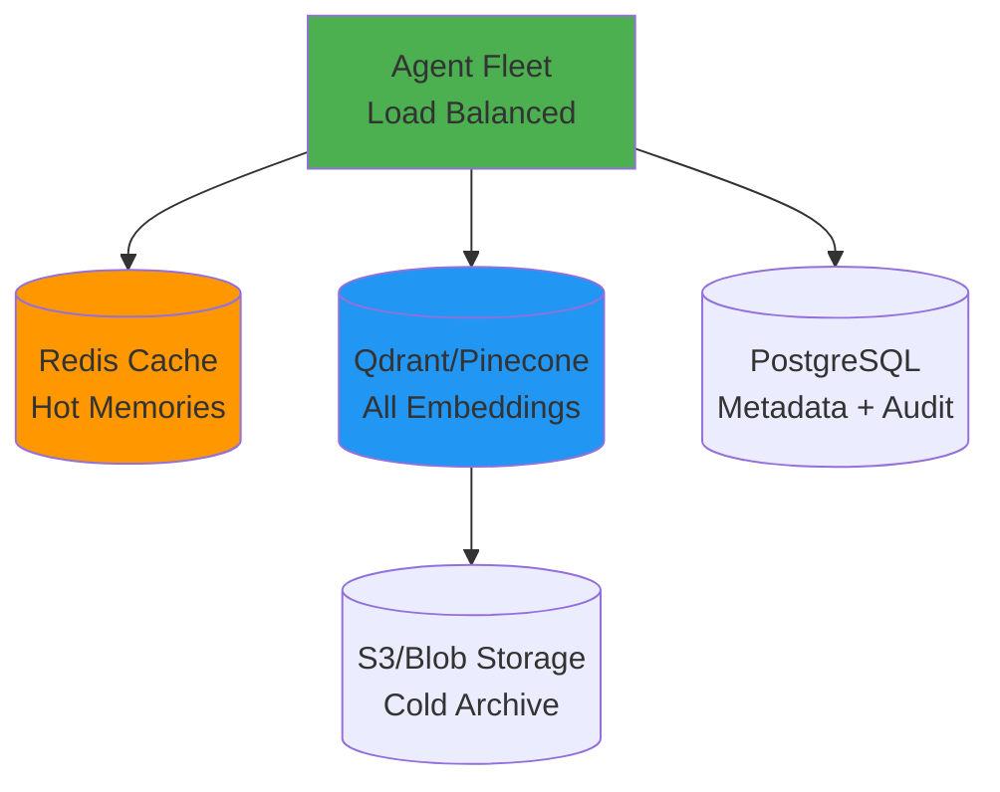
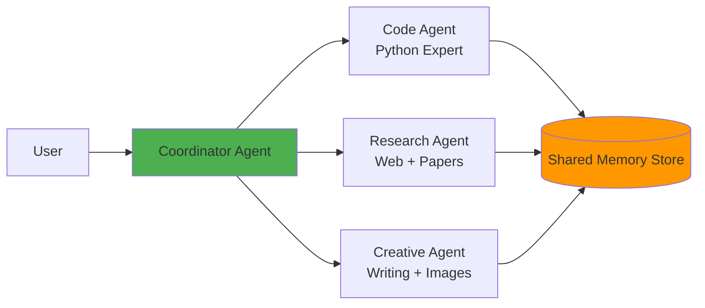

# Roadmap

## Table of Contents
- [Current Status](#current-status)
- [Known Limitations](#known-limitations)
- [Short-Term Goals](#short-term-goals-q1-2026)
- [Medium-Term Goals](#medium-term-goals-q2-2026)
- [Long-Term Vision](#long-term-vision-2026)
- [Feature Backlog](#feature-backlog)
- [Technical Debt](#technical-debt)

## Current Status

**Version:** 1.0.0 - Training/Demonstration Project

### Completed Features ✅

- [x] Long-term memory storage with FAISS
- [x] Semantic memory search (cosine similarity)
- [x] Automatic deduplication (>75% similarity)
- [x] Memory deletion
- [x] MCP integration (Python interpreter, web search)
- [x] File content extraction (PDF, CSV, TXT)
- [x] RAG search over uploaded documents
- [x] Image generation (DALL-E)
- [x] Stage-based UI feedback
- [x] User isolation via DIAL buckets

### In Development 🚧

- [ ] Comprehensive unit tests
- [ ] Integration test suite
- [ ] Performance benchmarks
- [ ] System prompt optimization

### Planned 📋

See sections below for detailed roadmap.

---

## Known Limitations

### 1. Memory System

| Limitation | Impact | Priority | Mitigation |
|------------|--------|----------|------------|
| No memory TTL | Old facts persist forever | Low | Manual deletion |
| 10k memory hard limit | Performance degrades after | Medium | Add sharding |
| No memory versioning | Can't track fact changes over time | Low | Store history |
| Irreversible deletion | No backup/restore | Medium | Add confirmation step |
| Single embedding model | No multilingual support | Low | Use multilingual model |

### 2. System Prompt

| Issue | Impact | Priority | Status |
|-------|--------|----------|--------|
| Inconsistent memory storage | LLM doesn't always store proactively | High | Iterating prompts |
| Over-storing | Stores trivial facts | Medium | Add relevance filter |
| Under-searching | Forgets to search before answering | High | Prompt refinement |

**Challenge:** Prompt engineering is highly model-dependent. Works well with GPT-4o, inconsistent with Claude.

### 3. Performance

| Bottleneck | Current | Target | Solution |
|------------|---------|--------|----------|
| Embedding generation | 50-100ms | <30ms | Batch encoding |
| FAISS search (1000 memories) | ~50ms | <20ms | IVF indexing |
| Deduplication (1000 memories) | 10-30s | <10s | Parallel processing |
| Memory file I/O | 100-300ms | <50ms | Redis cache |

### 4. Testing

- **No unit tests** for memory store, tools, or agent
- **No integration tests** for tool interactions
- **Manual testing only** - time-consuming, error-prone
- **No CI/CD** pipeline for automated testing

---

## Short-Term Goals (Q1 2026)

### 1. Test Coverage

**Priority:** High  
**Effort:** 2-3 weeks

- [ ] Unit tests for `LongTermMemoryStore` (80% coverage)
- [ ] Unit tests for all tools (70% coverage)
- [ ] Integration tests for memory + search workflows
- [ ] Performance benchmarks for memory operations
- [ ] GitHub Actions CI/CD pipeline

**Deliverable:** `pytest` suite with >70% coverage

### 2. System Prompt Optimization

**Priority:** High  
**Effort:** 1-2 weeks (iterative)

- [ ] A/B test different prompt variations
- [ ] Add examples of when to store/search
- [ ] Implement "chain of thought" for memory decisions
- [ ] Test across multiple LLMs (GPT-4, Claude, Gemini)
- [ ] Document best practices per model

**Success Metric:** >90% correct memory storage/search decisions

### 3. Memory Improvements

**Priority:** Medium  
**Effort:** 1 week

- [ ] Add memory importance auto-detection (analyze user emphasis)
- [ ] Implement memory update (vs. always adding new)
- [ ] Add memory expiry (TTL based on importance)
- [ ] Support batch memory storage (multiple facts at once)
- [ ] Add memory statistics (count, size, last updated)

**Deliverable:** Enhanced memory management capabilities

### 4. Documentation Updates

**Priority:** Medium  
**Effort:** 3-5 days

- [ ] Add API usage examples for all tools
- [ ] Create video tutorial (setup → testing → customization)
- [ ] Add troubleshooting FAQ
- [ ] Document common prompt engineering patterns
- [ ] Create contributor guide

---

## Medium-Term Goals (Q2 2026)

### 1. Advanced Memory Features

**Priority:** High  
**Effort:** 3-4 weeks

#### Temporal Memory
```python
class TemporalMemory:
    """Track fact changes over time"""
    history: list[MemoryVersion]
    current: Memory
    
# Example:
# V1: "Works at Google" (2025-01)
# V2: "Works at Microsoft" (2025-06)
# Query: "Where did user work in March?" → "Google"
```

#### Memory Relationships
```python
class MemoryGraph:
    """Connect related memories"""
    memories: dict[int, Memory]
    edges: list[tuple[int, int, str]]  # (from, to, relation)
    
# Example:
# "Lives in Paris" ← located_in → "France"
# "Prefers Python" ← uses_for → "Work at Google"
```

#### Smart Deduplication
- Use LLM to merge duplicate content intelligently
- Detect contradictions (e.g., "Lives in Paris" vs. "Lives in London")
- Prompt user to resolve conflicts

**Deliverable:** Context-aware memory system

### 2. Performance Optimization

**Priority:** High  
**Effort:** 2 weeks

- [ ] Implement Redis cache for cross-session memory sharing
- [ ] Add FAISS IVF index for >10k memories
- [ ] Batch embed multiple memories in parallel
- [ ] Lazy load embeddings (store only in FAISS, not JSON)
- [ ] Compress embeddings (384 float32 → 192 int8)

**Target:** 10x throughput improvement

### 3. Multi-Model Support

**Priority:** Medium  
**Effort:** 2 weeks

- [ ] Add model-specific system prompts
- [ ] Support switching embedding models (with migration)
- [ ] Test with open-source LLMs (Llama, Mistral)
- [ ] Add model comparison dashboard

**Deliverable:** Works consistently across 5+ models

### 4. Enhanced MCP Integration

**Priority:** Medium  
**Effort:** 1-2 weeks

- [ ] Add database query MCP server (SQL)
- [ ] Add chart generation MCP server (matplotlib)
- [ ] Add email/calendar MCP server (Gmail, Outlook)
- [ ] Implement MCP server health checks and auto-reconnect
- [ ] Add MCP server discovery (dynamic tool loading)

**Deliverable:** 5+ integrated MCP servers

---

## Long-Term Vision (2026+)

### 1. Production-Ready Memory System

**Goal:** Scale to millions of users with billions of memories

#### Architecture Changes



**Features:**
- Distributed caching (Redis cluster)
- Sharded vector storage (1M+ memories per user)
- Full-text search (Elasticsearch) alongside semantic
- Audit trail for memory CRUD operations
- Backup/restore with point-in-time recovery

### 2. Personalization Engine

**Goal:** Proactive, context-aware assistance

- **Contextual Awareness**: Auto-detect user context (time, location, recent activities)
- **Predictive Suggestions**: "You have a meeting in Paris next week - want weather?"
- **Adaptive Importance**: Learn from user interactions which memories matter most
- **Privacy Controls**: User-configurable retention policies, categories

### 3. Multi-Agent Collaboration

**Goal:** Specialized agents with shared memory



**Use Cases:**
- Code agent remembers user's coding style
- Research agent recalls previous searches
- Creative agent maintains user's aesthetic preferences

### 4. Advanced Analytics

**Goal:** Memory insights and optimization

- **Memory Dashboard**: Visualize memory growth, categories, importance distribution
- **Duplicate Detection**: Proactive suggestions to merge similar facts
- **Memory Gaps**: "I don't know your favorite food - want to tell me?"
- **Usage Patterns**: "You ask about weather often - store your location?"

---

## Feature Backlog

### High Priority

| Feature | Description | Effort | Dependencies |
|---------|-------------|--------|--------------|
| Unit Tests | 80% coverage for core components | 2 weeks | None |
| Prompt Optimization | Consistent memory behavior | 2 weeks | Test suite |
| Memory TTL | Auto-expire old memories | 1 week | None |
| Redis Cache | Cross-session memory cache | 1 week | Redis setup |
| Batch Operations | Store/search multiple memories | 3 days | None |

### Medium Priority

| Feature | Description | Effort | Dependencies |
|---------|-------------|--------|--------------|
| Memory Versioning | Track fact changes over time | 2 weeks | Storage migration |
| Smart Deduplication | LLM-powered merge | 1 week | LLM API |
| Memory Statistics | Dashboard with metrics | 3 days | None |
| Multi-language Support | Multilingual embeddings | 1 week | Model change |
| Memory Export | Download as JSON/CSV | 2 days | None |

### Low Priority

| Feature | Description | Effort | Dependencies |
|---------|-------------|--------|--------------|
| Memory Import | Upload existing facts | 2 days | Parser |
| Memory Sharing | Share facts between users | 1 week | Privacy model |
| Voice Memories | Speech-to-text integration | 1 week | MCP server |
| Memory Visualization | Graph view of relationships | 1 week | Frontend |
| Memory Tags | User-defined classifications | 3 days | UI updates |

---

## Technical Debt

### Code Quality

| Issue | Priority | Effort | Impact |
|-------|----------|--------|--------|
| No type hints in some modules | Medium | 2 days | Maintainability |
| Hardcoded constants (e.g., 0.75 threshold) | Low | 1 day | Configurability |
| Error handling inconsistent | High | 3 days | Reliability |
| Logging insufficient | Medium | 2 days | Debugging |

### Architecture

| Issue | Priority | Effort | Impact |
|-------|----------|--------|--------|
| Single-file storage limits scale | High | 1 week | Scalability |
| In-memory cache not distributed | Medium | 1 week | Multi-instance |
| No rate limiting | Medium | 2 days | Abuse prevention |
| Synchronous I/O in some paths | Low | 3 days | Performance |

### Infrastructure

| Issue | Priority | Effort | Impact |
|-------|----------|--------|--------|
| Manual deployment | Medium | 1 week | DevOps |
| No monitoring/alerting | High | 1 week | Observability |
| Secrets in config files | Critical | 1 day | Security |
| No backup strategy | High | 3 days | Data loss risk |

---

## Release Plan

### v1.1.0 - Testing & Stability (Feb 2026)

- ✅ Unit test coverage >70%
- ✅ Integration test suite
- ✅ CI/CD pipeline
- ✅ Improved error handling
- ✅ Logging and monitoring

### v1.2.0 - Memory Enhancements (Mar 2026)

- ✅ Memory TTL
- ✅ Batch operations
- ✅ Memory statistics
- ✅ Smart deduplication
- ✅ System prompt optimization

### v2.0.0 - Production Ready (Q2 2026)

- ✅ Redis cache
- ✅ FAISS IVF indexing
- ✅ Memory versioning
- ✅ Multi-model support
- ✅ Security hardening

### v3.0.0 - Scale & Intelligence (Q4 2026)

- ✅ Vector database integration
- ✅ Distributed architecture
- ✅ Personalization engine
- ✅ Multi-agent collaboration

---

## Contributing

Want to contribute? Check priority items:

**Quick Wins (Good First Issues):**
- Add type hints to `memory_store.py`
- Write unit tests for `SearchMemoryTool`
- Add memory export feature
- Improve error messages
- Add logging to tool executions

**Larger Projects:**
- Implement memory versioning
- Build Redis cache layer
- Create memory dashboard
- Add multilingual support
- Develop smart deduplication

**Research Needed:**
- Optimal similarity threshold for different use cases
- Memory importance learning from user behavior
- Efficient compression for embeddings
- Cross-user privacy-preserving memory sharing

---

## Risk Register

| Risk | Likelihood | Impact | Mitigation |
|------|------------|--------|------------|
| LLM doesn't store memories consistently | High | High | Iterative prompt engineering, model selection |
| Memory file corruption | Low | High | Add checksums, backup strategy |
| FAISS threading issues | Medium | Medium | Already mitigated (OMP_NUM_THREADS=1) |
| Deduplication too aggressive | Medium | Medium | User feedback loop, configurable threshold |
| API key leaks | Medium | Critical | Environment variables, secret management |
| MCP server downtime | Medium | Low | Graceful degradation, health checks |

---

## Feedback & Contributions

**GitHub Issues:** TODO: Add repository URL  
**Discussions:** TODO: Add discussion forum  
**Email:** TODO: Add contact

We welcome:
- Bug reports
- Feature requests
- Pull requests
- Documentation improvements
- Performance benchmarks

---

**Related Documents:**
- [Architecture](./architecture.md) - Current system design
- [Testing Guide](./testing.md) - Test strategy
- [Setup Guide](./setup.md) - Getting started
