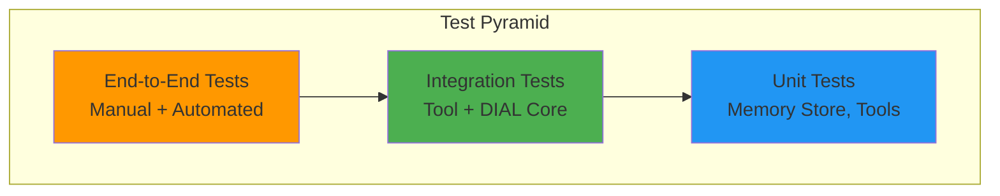
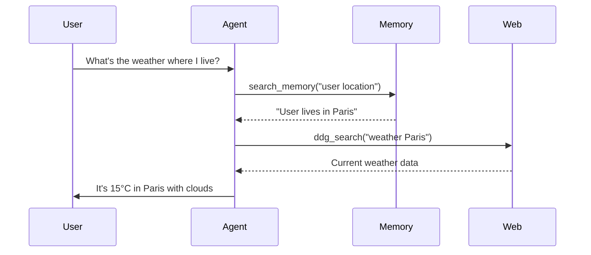

# Testing Guide

## Table of Contents
- [Testing Strategy](#testing-strategy)
- [Memory System Tests](#memory-system-tests)
- [Tool Validation](#tool-validation)
- [Integration Tests](#integration-tests)
- [Manual Testing Workflows](#manual-testing-workflows)
- [Performance Testing](#performance-testing)
- [Test Utilities](#test-utilities)

## Testing Strategy

### Test Pyramid



**Current State:** Primarily manual testing (training project)
**Recommended:** Add unit and integration tests for production

### Test Coverage Goals

| Component | Target Coverage | Current Status |
|-----------|----------------|----------------|
| Memory Store | 80%+ | TODO: Add tests |
| Memory Tools | 80%+ | TODO: Add tests |
| MCP Integration | 60%+ | TODO: Add tests |
| Agent Orchestration | 70%+ | TODO: Add tests |
| File Tools | 70%+ | TODO: Add tests |

### Test Environment

**Requirements:**
- Running DIAL infrastructure (`docker-compose up`)
- Activated virtual environment
- Test API keys configured
- Isolated test buckets for each user

**Setup:**
```bash
# Activate environment
source dial_agent_with_memory/bin/activate

# Start infrastructure
docker-compose up -d

# Wait for services
sleep 10

# Verify health
curl http://localhost:8080/health
```

---

## Memory System Tests

### Store Memory Tests

#### Test Case 1: Basic Storage

**Objective:** Verify memory is stored with correct embedding

**Steps:**
1. Start agent and open Chat UI
2. Send: "My name is Alice"
3. Verify agent calls `store_memory` tool
4. Check DIAL bucket for `__long-memories/data.json`

**Expected Result:**
```json
{
  "memories": [
    {
      "data": {
        "id": 1735689600,
        "content": "User's name is Alice",
        "importance": 0.9,
        "category": "personal_info",
        "topics": ["identity"]
      },
      "embedding": [0.023, -0.145, ..., 0.089]
    }
  ],
  "updated_at": "2025-12-31T12:00:00Z",
  "last_deduplicated_at": null
}
```

**Validation:**
- File exists at correct path
- Embedding is 384-dimensional array
- Timestamp is current UTC
- Memory count = 1

#### Test Case 2: Multiple Memories

**Objective:** Store and retrieve multiple distinct memories

**Steps:**
1. Send: "My name is Alice"
2. Send: "I live in Paris"
3. Send: "I prefer Python over JavaScript"
4. Send: "I work at Google"
5. Send: "I have a cat named Mittens"

**Expected Behavior:**
- Agent stores 5 separate memories
- Each has unique content
- Categories assigned correctly (personal_info, preferences, etc.)
- No duplicate detection yet (< 10 memories)

**Validation Script:**
```python
import json
from aidial_client import AsyncDial

async def validate_memories():
    client = AsyncDial(base_url="http://localhost:8080", api_key="dial_api_key")
    bucket = await client.get_app_home_path()
    
    response = await client.files.download(f"files/{bucket}/__long-memories/data.json")
    data = json.loads(response.content)
    
    assert len(data["memories"]) == 5
    assert all(len(m["embedding"]) == 384 for m in data["memories"])
    print("✅ All memories stored correctly")
```

#### Test Case 3: Importance Handling

**Objective:** Verify importance scores affect deduplication

**Steps:**
1. Store 15 memories with varying importance (0.3 to 1.0)
2. Wait for deduplication (or trigger manually)
3. Check which memories survive

**Expected Behavior:**
- High-importance memories (>0.8) retained
- Low-importance duplicates removed
- Deduplication timestamp updated

**Manual Trigger Deduplication:**
```python
from task.tools.memory.memory_store import LongTermMemoryStore

store = LongTermMemoryStore(endpoint="http://localhost:8080")
await store._deduplicate_memories(api_key="dial_api_key", collection=loaded_collection)
```

---

### Search Memory Tests

#### Test Case 4: Semantic Search

**Objective:** Verify semantic similarity finds relevant memories

**Setup:** Store these memories first:
- "User lives in Paris, France"
- "User enjoys croissants and coffee"
- "User works as a software engineer"
- "User prefers Python programming"

**Test Queries:**

| Query | Expected Top Result | Why |
|-------|---------------------|-----|
| "where does user live" | "User lives in Paris, France" | Direct match |
| "user's location" | "User lives in Paris, France" | Semantic similarity |
| "what does user do for work" | "User works as software engineer" | Paraphrase match |
| "programming languages" | "User prefers Python programming" | Topic match |
| "food preferences" | "User enjoys croissants and coffee" | Category match |

**Validation:**
```bash
# In Chat UI, new conversation
User: What do you remember about where I live?

# Expected behavior:
# 1. Agent calls search_memory with query ~"user location"
# 2. Returns "User lives in Paris, France"
# 3. Agent incorporates into response: "You live in Paris, France"
```

#### Test Case 5: Top-K Limit

**Objective:** Verify `top_k` parameter works correctly

**Steps:**
1. Store 20 memories
2. Search with `top_k=3`
3. Verify only 3 results returned
4. Verify they are highest-similarity matches

**API Test:**
```python
from task.tools.memory.memory_store import LongTermMemoryStore

store = LongTermMemoryStore(endpoint="http://localhost:8080")
results = await store.search_memories(
    api_key="dial_api_key",
    query="programming",
    top_k=3
)

assert len(results) <= 3
assert all(r[1] >= 0.5 for r in results)  # Similarity scores
```

#### Test Case 6: Empty Search

**Objective:** Handle search when no memories exist

**Steps:**
1. Start fresh conversation (no memories stored)
2. Agent searches memory
3. Verify graceful handling

**Expected Response:**
```
No memories found matching: "user preferences"
```

---

### Delete Memory Tests

#### Test Case 7: Delete All Memories

**Objective:** Verify complete deletion

**Steps:**
1. Store 10 memories
2. Verify file exists: `__long-memories/data.json`
3. Send: "Forget everything about me"
4. Verify agent calls `delete_all_memories`
5. Verify file deleted
6. Verify cache cleared

**Validation:**
```python
async def validate_deletion():
    client = AsyncDial(base_url="http://localhost:8080", api_key="dial_api_key")
    bucket = await client.get_app_home_path()
    
    try:
        await client.files.download(f"files/{bucket}/__long-memories/data.json")
        raise AssertionError("File should not exist")
    except Exception as e:
        if "not found" in str(e).lower():
            print("✅ Memories deleted successfully")
        else:
            raise
```

#### Test Case 8: Delete Confirmation

**Objective:** Ensure deletion only happens on explicit request

**Negative Tests:**
- "I don't like this" → Should NOT delete
- "Clear the screen" → Should NOT delete
- "Start over" → Should NOT delete

**Positive Tests:**
- "Delete my memories" → Should delete
- "Forget everything" → Should delete
- "Clear my data" → Should delete

---

### Deduplication Tests

#### Test Case 9: Similarity Threshold

**Objective:** Verify 75% similarity threshold for deduplication

**Setup:** Store similar memories:
1. "User lives in Paris, France"
2. "User is based in Paris"
3. "User's home is in Paris, France"

**Expected Behavior:**
- After deduplication, only 1-2 memories remain
- Highest importance memory kept
- Content merged if both high importance

**Validation:**
```python
from task.tools.memory.memory_store import LongTermMemoryStore
import numpy as np

store = LongTermMemoryStore(endpoint="http://localhost:8080")

# Generate embeddings for similar content
emb1 = store.model.encode("User lives in Paris, France")
emb2 = store.model.encode("User is based in Paris")

# Calculate cosine similarity
similarity = np.dot(emb1, emb2) / (np.linalg.norm(emb1) * np.linalg.norm(emb2))
print(f"Similarity: {similarity:.2f}")

assert similarity > 0.75  # Should trigger deduplication
```

#### Test Case 10: Deduplication Timing

**Objective:** Verify deduplication runs after 24h + >10 memories

**Steps:**
1. Store 5 memories → No deduplication
2. Store 6 more (total 11) → Check if deduplication runs
3. If not, manually set `last_deduplicated_at` to 25h ago
4. Add 1 more memory → Should trigger deduplication

**Mock Timestamp:**
```python
from datetime import datetime, timedelta, UTC

collection.last_deduplicated_at = datetime.now(UTC) - timedelta(hours=25)
await store._save_memories(api_key="dial_api_key", memories=collection)
```

---

## Tool Validation

### File Content Extraction Tests

#### Test Case 11: PDF Extraction

**Objective:** Extract text from uploaded PDF

**Steps:**
1. Upload PDF to Chat UI
2. Ask: "What's on page 3 of this document?"
3. Verify agent calls `extract_file_content`
4. Verify correct page extracted

**Sample PDF:** Use `test_data/sample.pdf` (create if missing)

**Expected Response:**
```
=== Page 3 ===

[Extracted text content...]
```

#### Test Case 12: CSV Parsing

**Objective:** Extract and format CSV data

**Test CSV:**
```csv
name,age,city
Alice,30,Paris
Bob,25,London
```

**Steps:**
1. Upload CSV
2. Ask: "Show me the data in this file"
3. Verify formatted table in response

**Expected Response:**
```
| name  | age | city   |
|-------|-----|--------|
| Alice | 30  | Paris  |
| Bob   | 25  | London |
```

---

### RAG Tool Tests

#### Test Case 13: Document Chunking

**Objective:** Verify documents split into searchable chunks

**Setup:**
1. Upload 5-page PDF with distinct topics per page
2. Query: "What does page 2 say about climate?"

**Expected Behavior:**
- Document chunked into ~10 chunks (500 tokens each)
- Relevant chunks from page 2 returned
- LLM synthesizes answer from chunks

**Validation:**
```python
from task.tools.rag.document_cache import DocumentCache

cache = DocumentCache.create()
chunks = await cache.get_chunks("files/bucket/doc.pdf")

assert len(chunks) > 5
assert all(len(chunk.text) < 600 for chunk in chunks)  # ~500 tokens
```

#### Test Case 14: Multi-Document Search

**Objective:** Search across multiple uploaded files

**Setup:**
1. Upload 3 PDFs: `report1.pdf`, `report2.pdf`, `summary.txt`
2. Query: "What are the key findings across all documents?"

**Expected Behavior:**
- RAG searches all 3 files
- Returns top-k chunks from each
- LLM combines findings

---

### MCP Tool Tests

#### Test Case 15: Python Code Execution

**Objective:** Verify stateful code execution

**Steps:**
```python
# Message 1
User: Run this code: x = 42

# Message 2
User: Now run: print(x * 2)
```

**Expected Output:**
```
84
```

**Validation:** Kernel state persists across calls

#### Test Case 16: Web Search

**Objective:** Verify DuckDuckGo search works

**Steps:**
1. Ask: "What's the weather in Tokyo?"
2. Verify agent calls `ddg_search`
3. Verify results returned

**Expected Behavior:**
- Search query: "weather Tokyo"
- 3-5 results with URLs
- Agent summarizes findings

---

## Integration Tests

### Test Case 17: Memory + Web Search

**Objective:** Combine memory retrieval with web search

**Steps:**
1. Store: "User lives in Paris"
2. New conversation
3. Ask: "What's the weather where I live?"

**Expected Flow:**


**Validation:** Agent should NOT ask "Where do you live?"

### Test Case 18: Memory + Code Execution

**Objective:** Use stored preferences for code

**Steps:**
1. Store: "User prefers Python"
2. Ask: "Write me a factorial function"

**Expected Behavior:**
- Agent writes Python (not JavaScript)
- Uses stored preference implicitly

---

## Manual Testing Workflows

### Workflow 1: Complete Memory Lifecycle

**Time Required:** 10 minutes

```bash
# 1. Store Phase (5 memories)
User: My name is Alice
User: I live in Paris, France
User: I work as a software engineer at Google
User: I prefer Python over JavaScript
User: I have a cat named Mittens

# Agent should respond with brief confirmations
# Verify: Check data.json has 5 memories

# 2. Search Phase (New Conversation)
User: What do you know about me?

# Expected: Agent lists all 5 facts

# 3. Contextual Retrieval
User: What should I wear today?

# Expected: Agent searches for location → finds Paris → searches weather

# 4. Deletion Phase
User: Delete all my memories

# Expected: Confirmation message
# Verify: data.json deleted

# 5. Verify Deletion
User: What's my name?

# Expected: "I don't have any information about your name"
```

### Workflow 2: System Prompt Testing

**Objective:** Verify agent stores memories proactively

**Positive Cases (Should Store):**
```
✅ "My favorite color is blue"
✅ "I'm learning Spanish"
✅ "I have a meeting every Monday at 9am"
✅ "I don't like spicy food"
```

**Negative Cases (Should NOT Store):**
```
❌ "What's 2+2?"
❌ "Tell me a joke"
❌ "What is Python?"
```

**Test:**
1. Send each message
2. Check if `store_memory` called (visible in stage or logs)
3. Verify only relevant facts stored

---

## Performance Testing

### Test Case 19: Large Memory Collection

**Objective:** Verify performance with 1000 memories

**Setup:**
```python
async def create_test_memories(n=1000):
    from task.tools.memory.memory_store import LongTermMemoryStore
    
    store = LongTermMemoryStore(endpoint="http://localhost:8080")
    
    for i in range(n):
        await store.add_memory(
            api_key="dial_api_key",
            content=f"Test memory {i}: Random fact about topic {i % 10}",
            importance=0.5,
            category="test",
            topics=[f"topic_{i % 10}"]
        )
```

**Metrics:**
- **Storage Time**: Should be < 200ms per memory
- **Search Time**: Should be < 500ms for top-5
- **Deduplication Time**: Should be < 30s for 1000 memories
- **Memory Usage**: Should be < 10MB for cached collection

**Validation:**
```python
import time

start = time.time()
results = await store.search_memories(api_key, query="topic", top_k=5)
duration = time.time() - start

assert duration < 0.5  # 500ms
print(f"Search completed in {duration:.3f}s")
```

### Test Case 20: Concurrent Requests

**Objective:** Verify cache consistency with concurrent access

**Setup:**
```python
import asyncio

async def concurrent_searches():
    tasks = [
        store.search_memories(api_key, query=f"query {i}", top_k=5)
        for i in range(10)
    ]
    results = await asyncio.gather(*tasks)
    return results

results = await concurrent_searches()
```

**Expected:** All requests succeed without cache corruption

---

## Test Utilities

### Mock Data Generator

```python
# tests/test_data.py

import random
from datetime import datetime, UTC

CATEGORIES = ["personal_info", "preferences", "goals", "plans", "context"]
TOPICS = ["programming", "lifestyle", "work", "family", "hobbies"]

def generate_test_memory(id: int) -> dict:
    return {
        "data": {
            "id": id,
            "content": f"Test memory content {id}",
            "importance": random.uniform(0.3, 1.0),
            "category": random.choice(CATEGORIES),
            "topics": random.sample(TOPICS, k=random.randint(1, 3))
        },
        "embedding": [random.uniform(-1, 1) for _ in range(384)]
    }

def generate_test_collection(n: int) -> dict:
    return {
        "memories": [generate_test_memory(i) for i in range(n)],
        "updated_at": datetime.now(UTC).isoformat(),
        "last_deduplicated_at": None
    }
```

### Assertion Helpers

```python
# tests/assertions.py

def assert_memory_valid(memory: dict):
    """Validate memory structure"""
    assert "data" in memory
    assert "embedding" in memory
    assert len(memory["embedding"]) == 384
    assert 0 <= memory["data"]["importance"] <= 1
    assert memory["data"]["category"] in CATEGORIES

def assert_search_results(results: list, expected_count: int):
    """Validate search results"""
    assert len(results) <= expected_count
    for memory, score in results:
        assert 0 <= score <= 1
        assert_memory_valid(memory)
```

### Test Fixtures

```python
# tests/conftest.py (pytest fixtures)

import pytest
from task.tools.memory.memory_store import LongTermMemoryStore

@pytest.fixture
async def memory_store():
    """Provide memory store instance"""
    return LongTermMemoryStore(endpoint="http://localhost:8080")

@pytest.fixture
async def populated_store(memory_store):
    """Memory store with 10 test memories"""
    for i in range(10):
        await memory_store.add_memory(
            api_key="test_key",
            content=f"Test memory {i}",
            importance=0.5,
            category="test",
            topics=[]
        )
    return memory_store
```

---

## Test Execution

### Running Tests

```bash
# Run all tests
pytest tests/ -v

# Run specific test file
pytest tests/test_memory_store.py -v

# Run with coverage
pytest --cov=task --cov-report=html tests/

# Run only memory tests
pytest tests/ -k memory

# Run with debug output
pytest tests/ -v -s
```

### Continuous Integration

```yaml
# .github/workflows/test.yml

name: Tests

on: [push, pull_request]

jobs:
  test:
    runs-on: ubuntu-latest
    
    steps:
      - uses: actions/checkout@v2
      
      - name: Set up Python
        uses: actions/setup-python@v2
        with:
          python-version: '3.12'
      
      - name: Install dependencies
        run: |
          python -m pip install --upgrade pip
          pip install -r requirements.txt
          pip install pytest pytest-cov
      
      - name: Start DIAL infrastructure
        run: docker-compose up -d
      
      - name: Wait for services
        run: sleep 20
      
      - name: Run tests
        run: pytest tests/ --cov=task --cov-report=xml
      
      - name: Upload coverage
        uses: codecov/codecov-action@v2
```

---

## Quality Metrics

### Success Criteria

- [ ] All manual workflows pass without errors
- [ ] Memory storage completes in < 200ms
- [ ] Search returns results in < 500ms
- [ ] Deduplication completes in < 30s for 1000 memories
- [ ] No cache corruption with concurrent access
- [ ] Agent stores memories proactively (>80% of cases)
- [ ] Agent searches before answering personal questions (>90% of cases)
- [ ] Deletion removes all traces of user data

### Known Issues

1. **System Prompt Consistency**: LLM doesn't always store memories proactively
   - **Workaround**: Iterate on prompt engineering
   - **Test**: Manual review of conversations

2. **FAISS Threading**: Occasional deadlocks in debug mode
   - **Fixed**: `OMP_NUM_THREADS=1` in memory_store.py

3. **Cache Invalidation**: Cache not cleared on manual file deletion
   - **Workaround**: Restart agent after manual bucket modifications

---

**Related Documents:**
- [API Reference](./api.md) - Tool schemas for test mocking
- [Architecture](./architecture.md) - System design understanding
- [Setup Guide](./setup.md) - Environment configuration for tests
